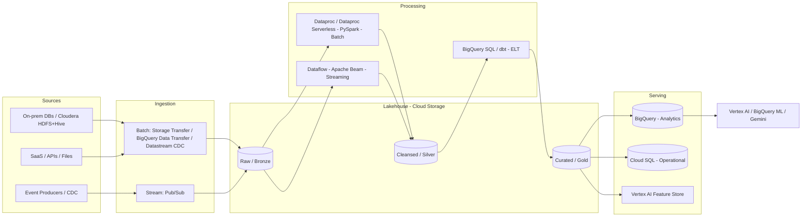

# Data & AI Platform on Google Cloud — End-to-End Deep Dive

> A production-grade blueprint for building **batch** and **real-time** data
> pipelines on Google Cloud using **Python** and **Apache Spark**, covering
> **ingestion → transformation → serving** into **BigQuery** and **Cloud SQL**,
> plus a phased **Cloudera (on-prem) → Google Cloud** migration.

---

## Table of Contents

1. [Goals & Scope](#1-goals--scope)
2. [Reference Architecture](#2-reference-architecture)
3. [Google Cloud Stack (Latest)](#3-google-cloud-stack-latest)
4. [Phase 0 — Foundations & Landing Zone](#4-phase-0--foundations--landing-zone)
5. [Phase 1 — Cloudera → Google Cloud Migration](#5-phase-1--cloudera--google-cloud-migration)
6. [Phase 2 — Batch Pipeline (Python + Spark)](#6-phase-2--batch-pipeline-python--spark)
7. [Phase 3 — Real-Time / Streaming Pipeline](#7-phase-3--real-time--streaming-pipeline)
8. [Data Modeling & Storage (BigQuery + Cloud SQL)](#8-data-modeling--storage-bigquery--cloud-sql)
9. [Orchestration, CI/CD & IaC](#9-orchestration-cicd--iac)
10. [Data Quality, Governance & Security](#10-data-quality-governance--security)
11. [Observability, Cost & FinOps](#11-observability-cost--finops)
12. [AI / ML & GenAI Layer](#12-ai--ml--genai-layer)
13. [Repository Layout](#13-repository-layout)
14. [End-to-End Runbook](#14-end-to-end-runbook)
15. [Roadmap & Milestones](#15-roadmap--milestones)

---

## 1. Goals & Scope

| Goal | Description |
| --- | --- |
| Unified platform | One lakehouse serving both batch and streaming workloads. |
| Lift & modernize | Migrate Cloudera (HDFS/Hive/Spark/Impala/Kafka/Oozie) to managed GCP services. |
| Python + Spark first | Reusable PySpark transforms that run on Dataproc **and** Dataproc Serverless. |
| Multi-sink serving | Analytical serving in **BigQuery**, operational/transactional serving in **Cloud SQL**. |
| Governed & observed | Central catalog, lineage, quality gates, security, cost controls. |
| AI-ready | Feature store + BigQuery ML + Vertex AI + Gemini/GenAI on curated data. |

**Non-goals (initial phases):** multi-cloud portability abstractions, custom
Kubernetes Spark operators (use managed Dataproc first).

---

## 2. Reference Architecture



**Medallion layering** in Cloud Storage (Bronze/Silver/Gold) keeps raw data
immutable, cleansed data conformed, and curated data business-ready.

---

## 3. Google Cloud Stack (Latest)

| Capability | Service | Notes |
| --- | --- | --- |
| Object lake storage | **Cloud Storage** | Bronze/Silver/Gold buckets; autoclass tiering. |
| Batch compute (Spark) | **Dataproc** + **Dataproc Serverless for Spark** | Serverless = no cluster mgmt, autoscaling. |
| Streaming compute | **Dataflow** (Apache Beam) | Exactly-once, autoscaling, streaming SQL. |
| Messaging / ingestion | **Pub/Sub** | Global, at-least-once; Pub/Sub → BigQuery direct subscriptions. |
| CDC replication | **Datastream** | Oracle/MySQL/PostgreSQL → BigQuery/GCS, low-latency. |
| Data warehouse | **BigQuery** (+ **BigLake**, **BQ Storage Write API**) | Serverless analytics; open-format tables via BigLake. |
| Operational SQL | **Cloud SQL** (PostgreSQL/MySQL) / **AlloyDB** | Transactional serving, low-latency lookups. |
| Table format | **Apache Iceberg** via **BigLake** / Delta on GCS | Open lakehouse tables, ACID, time travel. |
| Orchestration | **Cloud Composer** (Airflow 2/3) or **Workflows** | DAG scheduling & dependencies. |
| Transform (ELT) | **dbt** on BigQuery / **Dataform** | SQL modeling, tests, docs, lineage. |
| Catalog & governance | **Dataplex** (Universal Catalog) | Discovery, quality, lineage, policy. |
| Secrets & keys | **Secret Manager**, **Cloud KMS** | CMEK, credential storage. |
| ML / AI | **Vertex AI**, **BigQuery ML**, **Feature Store**, **Gemini** | Training, serving, GenAI. |
| IaC | **Terraform** (google provider) | Reproducible environments. |
| CI/CD | **Cloud Build** / **GitHub Actions** | Build, test, deploy pipelines. |
| Observability | **Cloud Monitoring/Logging**, **Cloud Trace** | Metrics, logs, SLOs, alerts. |

---

## 4. Phase 0 — Foundations & Landing Zone

**Objectives:** secure, repeatable environments before any data moves.

- **Project & folder structure:** separate `dev`, `test`, `prod` projects.
- **Networking:** Shared VPC, Private Service Connect / Private Google Access,
  no public IPs on data compute.
- **Identity:** least-privilege IAM, per-pipeline service accounts, Workload
  Identity Federation (no static keys).
- **State & IaC:** Terraform with a **remote GCS backend** (state bucket per env),
  reuse the existing modules in `infra/gcp-storage-terraform` and
  `infra/bigquery-terraform`.
- **Baseline buckets:** `bronze`, `silver`, `gold`, plus `artifacts` and
  `tf-state`.
- **APIs to enable:**
  ```bash
  gcloud services enable \
    storage.googleapis.com bigquery.googleapis.com dataproc.googleapis.com \
    dataflow.googleapis.com pubsub.googleapis.com datastream.googleapis.com \
    composer.googleapis.com sqladmin.googleapis.com dataplex.googleapis.com \
    aiplatform.googleapis.com secretmanager.googleapis.com cloudkms.googleapis.com
  ```

**Deliverables:** landing zone Terraform, IAM baseline, network, CI/CD skeleton.

---

## 5. Phase 1 — Cloudera → Google Cloud Migration

Goal: retire on-prem Cloudera (CDH/CDP) and land equivalent capabilities on
managed GCP services with minimal rewrite.

### 5.1 Component mapping

| Cloudera / On-prem | Google Cloud target |
| --- | --- |
| HDFS | **Cloud Storage** (via Cloud Storage connector for Hadoop) |
| Hive Metastore | **Dataproc Metastore** (managed Hive Metastore) |
| Hive / Impala SQL | **BigQuery** (+ BigLake for open tables) |
| Spark / MapReduce jobs | **Dataproc** / **Dataproc Serverless for Spark** |
| Kafka | **Pub/Sub** (or Managed Kafka if protocol parity required) |
| Oozie workflows | **Cloud Composer (Airflow)** / **Workflows** |
| HBase | **Bigtable** |
| Sentry/Ranger policies | **IAM + Dataplex + BigLake row/column policies** |
| Sqoop ingestion | **Datastream** (CDC) / **Dataflow** / batch export |

### 5.2 Migration approach (assess → migrate → validate)

1. **Assess & inventory**
   - Catalog datasets, Hive schemas, job DAGs, SLAs, data volumes.
   - Classify workloads: rehost (lift), replatform (managed), refactor (BigQuery-native).
2. **Data migration**
   - **Bulk history:** HDFS → GCS via `hadoop distcp` to the GCS connector, or
     **Storage Transfer Service** for large one-time/scheduled transfers.
   - **Incremental / CDC:** **Datastream** for relational sources; keep deltas
     flowing during cutover.
   - **Schema:** export Hive DDL → recreate as **Dataproc Metastore** +
     BigLake/BigQuery external tables over GCS.
3. **Job migration**
   - PySpark/Spark jobs run largely unchanged on **Dataproc**; move to
     **Dataproc Serverless** to drop cluster ops.
   - Replace `hdfs://` paths with `gs://`; point to Dataproc Metastore.
   - Convert Impala/Hive analytics to **BigQuery SQL** where it pays off.
4. **Orchestration migration**
   - Translate Oozie coordinators/workflows into **Airflow DAGs** in Composer.
5. **Validate & cut over**
   - Row counts, checksums, and reconciliation queries (source vs. GCP).
   - Parallel-run (dual-write / dual-read) until parity is proven, then cut over.
6. **Decommission** on-prem after a stability window.

### 5.3 Cutover strategy

- **Strangler pattern:** migrate dataset-by-dataset, redirect consumers gradually.
- **Reconciliation gate:** automated count/hash checks must pass before flip.
- **Rollback:** keep on-prem read-only until sign-off.

---

## 6. Phase 2 — Batch Pipeline (Python + Spark)

**Pattern:** ELT-leaning medallion. PySpark handles heavy transforms; BigQuery/dbt
handles set-based modeling.

### 6.1 Flow

1. **Ingest** source files/exports → `gs://.../bronze/<source>/<date>/`.
2. **Transform (PySpark on Dataproc Serverless):** clean, dedupe, conform types,
   SCD handling → `silver`.
3. **Model (dbt on BigQuery):** business logic, marts → `gold` / BigQuery.
4. **Serve:** publish curated marts to **BigQuery**; push operational subsets to
   **Cloud SQL**.

### 6.2 PySpark transform (Bronze → Silver) skeleton

```python
# jobs/batch/bronze_to_silver.py
from pyspark.sql import SparkSession, functions as F

def build_spark(app_name: str) -> SparkSession:
    return (
        SparkSession.builder.appName(app_name)
        # BigQuery + GCS connectors are preinstalled on Dataproc images
        .getOrCreate()
    )

def transform(df):
    return (
        df.dropDuplicates(["id"])
          .withColumn("amount", F.col("amount").cast("decimal(18,2)"))
          .withColumn("created_at", F.to_timestamp("created_at"))
          .filter(F.col("id").isNotNull())
    )

def main(bronze_path: str, silver_path: str):
    spark = build_spark("bronze_to_silver")
    df = spark.read.parquet(bronze_path)
    out = transform(df)
    (out.write.mode("overwrite")
        .partitionBy("event_date")
        .parquet(silver_path))
    spark.stop()

if __name__ == "__main__":
    import argparse
    p = argparse.ArgumentParser()
    p.add_argument("--bronze", required=True)
    p.add_argument("--silver", required=True)
    a = p.parse_args()
    main(a.bronze, a.silver)
```

### 6.3 Submit on Dataproc Serverless

```bash
gcloud dataproc batches submit pyspark jobs/batch/bronze_to_silver.py \
  --project="$PROJECT_ID" --region="$REGION" \
  --deps-bucket="gs://${PROJECT_ID}-artifacts" \
  -- --bronze="gs://${PROJECT_ID}-bronze/events/2026-08-25/" \
     --silver="gs://${PROJECT_ID}-silver/events/"
```

### 6.4 Silver → BigQuery (Storage Write API via connector)

```python
(out.write.format("bigquery")
    .option("table", f"{PROJECT_ID}.curated.events")
    .option("writeMethod", "direct")   # BigQuery Storage Write API
    .partitionBy("event_date")
    .mode("append")
    .save())
```

---

## 7. Phase 3 — Real-Time / Streaming Pipeline

**Pattern:** Pub/Sub → Dataflow (Beam) → BigQuery (+ Cloud SQL for state/serving).

### 7.1 Flow

1. Producers/CDC publish JSON/Avro events to **Pub/Sub**.
2. **Dataflow** streaming job parses, validates, enriches, windows, and writes:
   - **BigQuery** (Storage Write API) for analytics.
   - **Cloud SQL/AlloyDB** for low-latency operational lookups.
3. Dead-letter topic captures malformed events for replay.

### 7.2 Options

- **Low-code:** Pub/Sub **direct BigQuery subscription** (no code) for simple
  landing.
- **Full control:** **Dataflow** (Beam Python) for parsing, windowing,
  enrichment, exactly-once.
- **Spark Structured Streaming** on Dataproc if you must keep Spark parity from
  Cloudera.

### 7.3 Beam (Dataflow) streaming skeleton

```python
# jobs/stream/pubsub_to_bq.py
import apache_beam as beam
from apache_beam.options.pipeline_options import PipelineOptions, StandardOptions
import json

class Parse(beam.DoFn):
    def process(self, msg):
        try:
            rec = json.loads(msg.decode("utf-8"))
            yield {
                "id": rec["id"],
                "name": rec.get("name"),
                "amount": rec.get("amount"),
                "created_at": rec["created_at"],
            }
        except Exception:
            yield beam.pvalue.TaggedOutput("dead_letter", msg)

def run(argv=None):
    opts = PipelineOptions(argv, streaming=True)
    opts.view_as(StandardOptions).streaming = True
    with beam.Pipeline(options=opts) as p:
        parsed = (
            p
            | "Read" >> beam.io.ReadFromPubSub(subscription="SUBSCRIPTION")
            | "Parse" >> beam.ParDo(Parse()).with_outputs("dead_letter", main="rows")
        )
        (parsed.rows
            | "ToBQ" >> beam.io.WriteToBigQuery(
                table="PROJECT:curated.events_stream",
                write_disposition=beam.io.BigQueryDisposition.WRITE_APPEND,
                create_disposition=beam.io.BigQueryDisposition.CREATE_NEVER,
                method="STORAGE_WRITE_API"))
        (parsed.dead_letter
            | "DLQ" >> beam.io.WriteToPubSub(topic="DLQ_TOPIC"))

if __name__ == "__main__":
    run()
```

### 7.4 Deploy the streaming job

```bash
python jobs/stream/pubsub_to_bq.py \
  --runner=DataflowRunner --project="$PROJECT_ID" --region="$REGION" \
  --temp_location="gs://${PROJECT_ID}-artifacts/tmp" \
  --streaming
```

---

## 8. Data Modeling & Storage (BigQuery + Cloud SQL)

### 8.1 BigQuery (analytical)

- **Partitioning:** by ingestion/event date; **clustering** on high-filter columns.
- **Layering:** `raw` → `staging` → `curated`/`marts` datasets.
- **Open tables:** **BigLake + Iceberg** for lakehouse interop where needed.
- **Loading:** prefer **Storage Write API** (streaming + batch) over legacy inserts.
- Reuse the module in `infra/bigquery-terraform` to provision datasets/tables.

### 8.2 Cloud SQL (operational)

- Serves transactional lookups, APIs, and app back-ends needing row-level, low
  latency access.
- Curated aggregates pushed from Spark/Dataflow via JDBC or scheduled export.
- Use **AlloyDB** when you need higher performance / HTAP.

### 8.3 Choosing the sink

| Need | Use |
| --- | --- |
| Ad-hoc analytics, large scans, ML features | **BigQuery** |
| Point lookups, transactional writes, app back-end | **Cloud SQL / AlloyDB** |
| Wide-column, high-throughput key access | **Bigtable** |

---

## 9. Orchestration, CI/CD & IaC

### 9.1 Orchestration (Cloud Composer / Airflow)

```python
# dags/batch_daily.py
from airflow import DAG
from airflow.providers.google.cloud.operators.dataproc import DataprocCreateBatchOperator
from airflow.providers.google.cloud.transfers.gcs_to_bigquery import GCSToBigQueryOperator
from datetime import datetime

with DAG("batch_daily", schedule="0 2 * * *",
         start_date=datetime(2026, 1, 1), catchup=False) as dag:

    bronze_to_silver = DataprocCreateBatchOperator(
        task_id="bronze_to_silver",
        batch={"pyspark_batch": {
            "main_python_file_uri": "gs://ARTIFACTS/jobs/batch/bronze_to_silver.py"}},
        region="us-central1", batch_id="bronze-silver-{{ ds_nodash }}",
    )

    load_curated = GCSToBigQueryOperator(
        task_id="load_curated",
        bucket="PROJECT-silver", source_objects=["events/*"],
        destination_project_dataset_table="PROJECT.curated.events",
        source_format="PARQUET", write_disposition="WRITE_APPEND",
    )

    bronze_to_silver >> load_curated
```

### 9.2 CI/CD

- **Build:** lint (ruff), unit tests (pytest), package PySpark/Beam jobs.
- **Deploy:** upload job artifacts to GCS, sync DAGs to Composer, `terraform apply`.
- Trigger via **Cloud Build** or **GitHub Actions** on merge to `main`.

### 9.3 IaC

- All infra in **Terraform**; environments driven by `*.tfvars` (as already done
  under `infra/`). Remote GCS backend + workspaces per environment.

---

## 10. Data Quality, Governance & Security

- **Quality:** enforce with **Dataplex data quality**, dbt tests, and Great
  Expectations in PySpark; quarantine failures to a DLQ path/table.
- **Catalog & lineage:** **Dataplex Universal Catalog** for discovery + lineage.
- **Access control:** IAM + BigLake **row/column-level policies**; column masking
  for PII.
- **Encryption:** CMEK via **Cloud KMS**; secrets in **Secret Manager**.
- **Network:** private egress, VPC-SC perimeter around data services.
- **Auditing:** Cloud Audit Logs for all data access.

---

## 11. Observability, Cost & FinOps

- **Metrics/logs:** Cloud Monitoring + Logging dashboards for Dataflow lag,
  Dataproc batch duration, BigQuery slot/bytes usage.
- **SLOs & alerts:** freshness, latency, and failure-rate alerts.
- **Cost controls:**
  - BigQuery: partition/cluster, use **BI Engine** selectively, editions/slot
    reservations vs on-demand; set **custom quotas**.
  - Dataproc Serverless autoscaling; right-size Dataflow workers.
  - Storage **Autoclass** + lifecycle rules (see `infra/gcp-storage-terraform`).
- **Tagging/labels:** label every resource with `environment`, `team`, `pipeline`
  for cost attribution.

---

## 12. AI / ML & GenAI Layer

- **BigQuery ML:** train/forecast directly in SQL for quick wins.
- **Vertex AI:** managed training, pipelines, model registry, endpoints.
- **Feature Store:** serve consistent features for training and online inference.
- **GenAI (Gemini on Vertex AI):** RAG over curated BigQuery/GCS data; the repo
  already uses `google-genai` (see `requirements.txt`, `scripts/`), with
  `GOOGLE_GENAI_USE_VERTEXAI="true"` and `GOOGLE_CLOUD_LOCATION="us-central1"`.

---

## 13. Repository Layout

```
Google_AI_With_Data_Projects/
├── Data_AI.md                     # this document
├── requirements.txt
├── infra/
│   ├── gcp-storage-terraform/     # GCS lakehouse buckets
│   ├── bigquery-terraform/        # datasets + tables
│   ├── cloudsql-terraform/        # (to add) operational DB
│   ├── pubsub-terraform/          # (to add) topics/subscriptions
│   └── composer-terraform/        # (to add) orchestration env
├── jobs/
│   ├── batch/                     # PySpark batch jobs
│   └── stream/                    # Beam/Dataflow streaming jobs
├── dags/                          # Airflow DAGs (Composer)
├── dbt/                           # dbt models, tests, docs
├── migration/                     # Cloudera→GCP scripts, mappings, recon
└── scripts/                       # GenAI / utilities
```

---

## 14. End-to-End Runbook

```bash
# 0. Auth & project
gcloud auth login
gcloud config set account mamathaanjireddy@gmail.com
gcloud config set project project-52e8c95d-822f-4563-a7e
gcloud auth application-default login
export GOOGLE_CLOUD_LOCATION="us-central1"
export GOOGLE_GENAI_USE_VERTEXAI="true"
export PROJECT_ID="project-52e8c95d-822f-4563-a7e"
export REGION="us-central1"

# 1. Provision infra (per environment)
cd infra/gcp-storage-terraform && terraform init && \
  terraform apply -var-file=environments/dev.tfvars && cd -
cd infra/bigquery-terraform && terraform init && \
  terraform apply -var-file=environments/dev.tfvars && cd -

# 2. Migrate history from Cloudera (example)
#    On the on-prem edge node with the GCS connector configured:
# hadoop distcp hdfs:///warehouse/events gs://${PROJECT_ID}-bronze/events/

# 3. Run a batch transform (Dataproc Serverless)
gcloud dataproc batches submit pyspark jobs/batch/bronze_to_silver.py \
  --project="$PROJECT_ID" --region="$REGION" \
  --deps-bucket="gs://${PROJECT_ID}-artifacts" \
  -- --bronze="gs://${PROJECT_ID}-bronze/events/" \
     --silver="gs://${PROJECT_ID}-silver/events/"

# 4. Deploy the streaming job (Dataflow)
python jobs/stream/pubsub_to_bq.py \
  --runner=DataflowRunner --project="$PROJECT_ID" --region="$REGION" \
  --temp_location="gs://${PROJECT_ID}-artifacts/tmp" --streaming

# 5. Model curated marts (dbt on BigQuery)
# dbt run && dbt test

# 6. Verify
bq ls --project_id "$PROJECT_ID"
gcloud storage ls gs://${PROJECT_ID}-silver/events/
```

---

## 15. Roadmap & Milestones

| Phase | Milestone | Exit criteria |
| --- | --- | --- |
| 0 | Landing zone | IaC-provisioned dev/test/prod, IAM, network, CI/CD. |
| 1 | Cloudera migration | History + CDC landed, jobs on Dataproc, recon passes. |
| 2 | Batch platform | Bronze→Silver→Gold running daily, dbt marts in BigQuery. |
| 3 | Streaming platform | Pub/Sub→Dataflow→BigQuery live with DLQ + SLOs. |
| 4 | Governance | Dataplex catalog, quality gates, column-level security. |
| 5 | AI/ML | Feature store, BQML/Vertex models, GenAI RAG in prod. |

---

### Next steps I can help with

- Scaffold `jobs/batch`, `jobs/stream`, `dags/`, and `dbt/` with working starter code.
- Add Terraform modules for **Cloud SQL**, **Pub/Sub**, and **Cloud Composer**.
- Build the **migration/** reconciliation scripts (count/hash validation).
